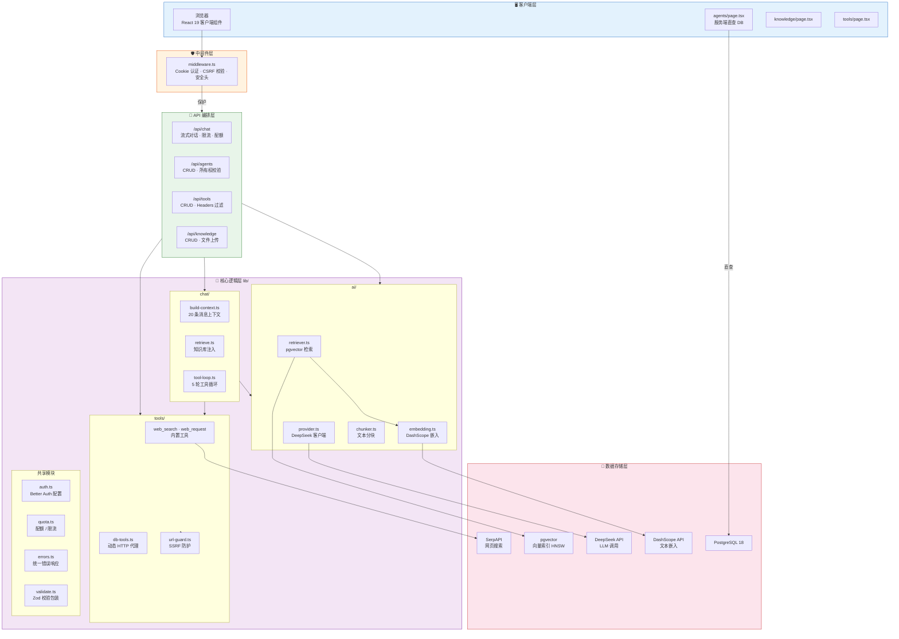
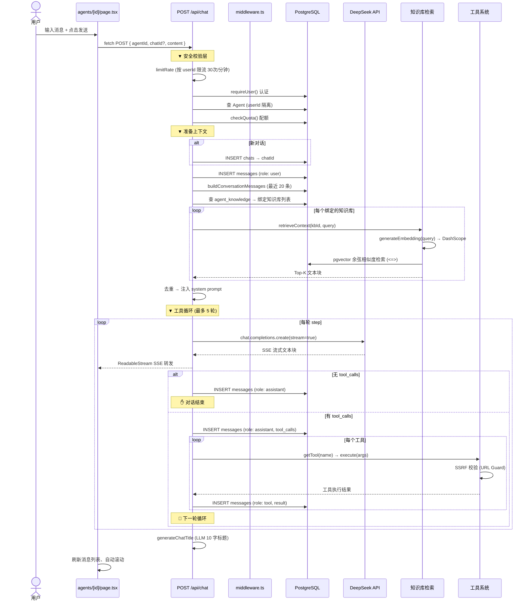
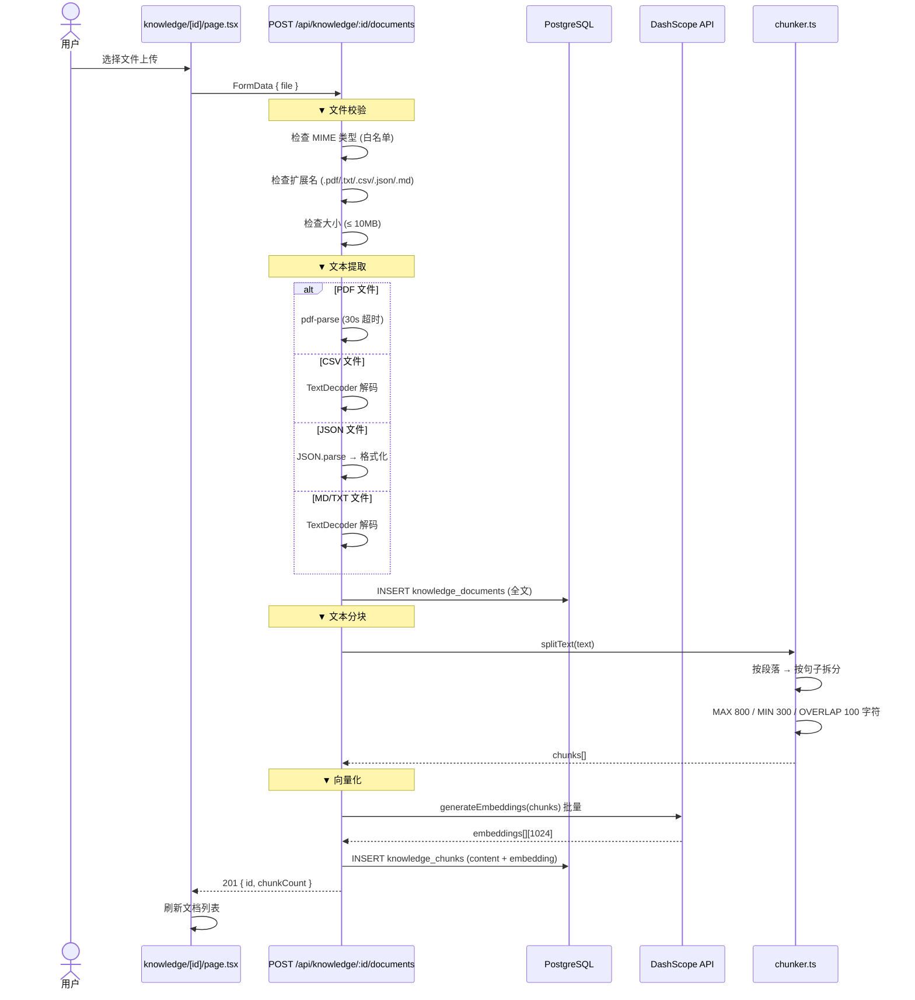
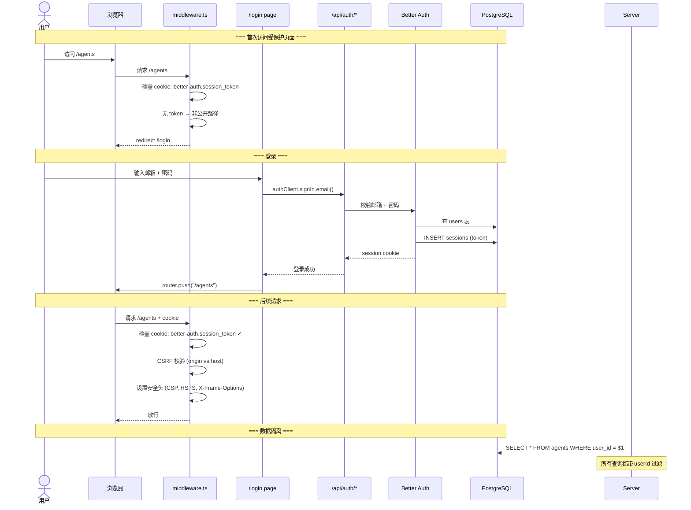
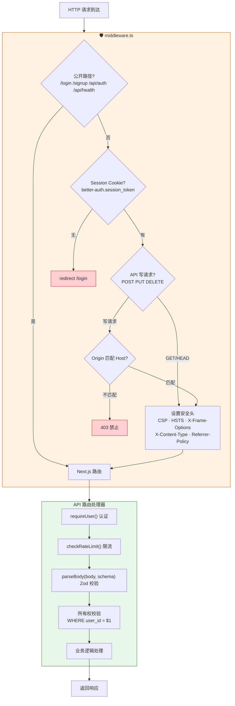

# 架构文档

> 版本: v3.0 | 日期: 2026-07-26

## 概述

Simple AI Agent Platform 是一个轻量级多用户 AI Agent 管理平台。基于 Next.js 16 App Router，提供 Agent 创建/配置、流式对话、工具调用、知识库（RAG）和用户认证功能。

## 技术栈

| 层级 | 技术 | 版本 |
|------|------|------|
| Framework | Next.js (App Router) | 16 |
| UI | React + Tailwind CSS + shadcn/ui | 19 / 4 |
| Language | TypeScript (strict) | 6 |
| Database | PostgreSQL + pgvector | 18 |
| ORM | Drizzle ORM | 0.45 |
| AI SDK | OpenAI SDK (DeepSeek) | 6 |
| Streaming | ReadableStream SSE | — |
| Embedding | 阿里云 DashScope (text-embedding-v3) | 1024 dims |
| Auth | Better Auth (邮箱+密码) | 1.x |
| Validation | Zod | 4 |

---

## 1. 系统分层架构



---

## 2. 数据模型 ER 图

```mermaid
erDiagram
    users {
        uuid id PK "默认随机"
        varchar name
        varchar email UK
        bool email_verified
        timestamp created_at
        timestamp updated_at
    }

    agents {
        uuid id PK
        uuid user_id FK "→ users.id"
        varchar name
        text system_prompt
        varchar model "默认 deepseek-chat"
        numeric temperature "默认 0.7"
        int max_tokens "默认 4096"
        timestamp created_at
        timestamp updated_at
    }

    agent_tools {
        uuid agent_id PK_FK "→ agents.id CASCADE"
        uuid tool_id PK_FK "→ tools.id CASCADE"
    }

    chats {
        uuid id PK
        uuid agent_id FK "→ agents.id CASCADE"
        varchar title "默认 新对话"
        timestamp created_at
        timestamp updated_at
    }

    messages {
        uuid id PK
        uuid chat_id FK "→ chats.id CASCADE"
        varchar role "user|assistant|tool"
        text content
        jsonb tool_calls "only assistant"
        jsonb tool_result "only tool"
        timestamp created_at
    }

    tools {
        uuid id PK
        uuid user_id FK "→ users.id"
        varchar name
        text description
        jsonb parameters
        varchar endpoint
        varchar method "GET|POST"
        jsonb headers
        timestamp created_at
        timestamp updated_at
    }

    knowledge_bases {
        uuid id PK
        uuid user_id FK "→ users.id"
        varchar name
        timestamp created_at
    }

    knowledge_documents {
        uuid id PK
        uuid kb_id FK "→ knowledge_bases.id CASCADE"
        varchar filename
        text content "原始全文"
        timestamp created_at
    }

    knowledge_chunks {
        uuid id PK
        uuid doc_id FK "→ knowledge_documents.id CASCADE"
        uuid kb_id FK "→ knowledge_bases.id CASCADE"
        text content
        vector embedding "1024 维"
        int chunk_index
    }

    agent_knowledge {
        uuid agent_id PK_FK "→ agents.id CASCADE"
        uuid kb_id PK_FK "→ knowledge_bases.id CASCADE"
    }

    sessions {
        uuid id PK
        uuid user_id FK "→ users.id CASCADE"
        varchar token
        timestamp expires_at
    }

    accounts {
        uuid id PK
        uuid user_id FK "→ users.id CASCADE"
        varchar provider_id
        varchar password
    }

    verifications {
        uuid id PK
        varchar identifier
        varchar value
        timestamp expires_at
    }

    users ||--o{ agents : "创建"
    users ||--o{ tools : "创建"
    users ||--o{ knowledge_bases : "创建"
    users ||--o{ sessions : "拥有"
    users ||--o{ accounts : "拥有"
    users ||--o| verifications : "验证"

    agents ||--o{ chats : "包含"
    agents ||--o{ agent_tools : "绑定"
    agents ||--o{ agent_knowledge : "绑定"

    tools ||--o{ agent_tools : "被引用"
    knowledge_bases ||--o{ agent_knowledge : "被引用"

    chats ||--o{ messages : "包含"

    knowledge_bases ||--o{ knowledge_documents : "包含"
    knowledge_documents ||--o{ knowledge_chunks : "切片"
```

---

## 3. 对话核心流程



---

## 4. RAG 知识库流程



---

## 5. 认证流程



---

## 6. 工具调用循环

```mermaid
sequenceDiagram
    participant Loop as tool-loop.ts
    participant LLM as DeepSeek API
    participant Tool as getTool()
    participant Builtin as 内置工具
    participant DBTool as 自定义 HTTP 工具
    participant Guard as url-guard.ts
    participant DB as PostgreSQL

    Note over Loop: 最多 5 轮循环

    Loop->>LLM: openai.chat.completions.create(stream=true, tools)
    LLM-->>Loop: 流式文本块 (逐 token)

    alt 响应文本
        Loop-->>Controller: enqueue 文本到 SSE
    end

    alt 模型返回 tool_calls
        Loop->>DB: 保存 assistant 消息 (含 tool_calls)
        Loop->>LLM: 提交 tool_call 到消息上下文

        loop 每个 tool_call
            Loop->>Tool: getTool(toolName)

            alt 内置工具: web_search
                Tool->>Builtin: search-execute.ts
                Builtin->>Builtin: fetch SerpAPI (x-api-key header)
                Builtin-->>Tool: 搜索结果 top 5
            else 内置工具: web_request
                Tool->>Builtin: web-request-execute.ts
                Builtin->>Guard: validateExternalUrlWithDNS(url)
                Guard->>Guard: 检查 hostname 前缀
                Guard->>Guard: DNS 解析 → 检查 IP
                Guard-->>Builtin: 放行 ✓
                Builtin->>Builtin: fetch(url, redirect: error)
                Builtin-->>Tool: 响应文本 ≤ 2000 字符
            else 自定义工具 (DB)
                Tool->>DBTool: db-tools.ts
                DBTool->>Guard: validateExternalUrlWithDNS(endpoint)
                DBTool->>DBTool: sanitizeHeaders (过滤 Host 等)
                DBTool->>DBTool: GET: 拼 URL params / POST: JSON body
                DBTool->>DBTool: fetch(endpoint, redirect: error)
                DBTool-->>Tool: 响应文本 ≤ 2000 字符
            end

            Tool-->>Loop: 工具执行结果
            Loop-->>Controller: enqueue "🔍 调用 {name}..."
            Loop->>DB: 保存 tool 消息 (role: tool)
        end

        Note over Loop: 🔄 下一轮循环 (tools 结果喂回 LLM)
    end

    Note over Loop: ✋ 无 tool_calls 或达到最大轮数 → 结束
```

---

## 7. 请求安全处理流水线



---

## 目录结构

```
src/
├── app/
│   ├── layout.tsx                  # 根布局 + Header
│   ├── page.tsx                    # / → redirect /agents
│   ├── globals.css                 # Tailwind 入口
│   ├── error.tsx                   # 错误边界
│   ├── global-error.tsx            # 全局错误边界
│   ├── login/page.tsx              # 登录页（客户端）
│   ├── signup/page.tsx             # 注册页（客户端）
│   ├── agents/
│   │   ├── page.tsx                # Agent 列表（服务端直查DB）
│   │   ├── new/page.tsx            # 创建 Agent
│   │   └── [id]/
│   │       ├── page.tsx            # 聊天页（客户端 SSE）
│   │       └── edit/page.tsx       # 编辑 Agent（服务端）
│   ├── tools/
│   │   ├── page.tsx                # 工具列表
│   │   ├── new/page.tsx            # 创建工具
│   │   └── [id]/edit/page.tsx      # 编辑工具
│   ├── knowledge/
│   │   ├── page.tsx                # 知识库列表
│   │   ├── new/page.tsx            # 创建知识库
│   │   └── [id]/page.tsx           # 知识库详情 + 文档
│   └── api/
│       ├── agents/                 # Agent CRUD
│       ├── chat/                   # 流式对话核心
│       ├── chats/                  # 对话管理
│       ├── tools/                  # 工具 CRUD
│       ├── knowledge/              # 知识库 CRUD + 文档
│       ├── health/                 # 健康检查
│       └── auth/[...all]/          # Better Auth 回调
├── components/
│   ├── ui/                         # shadcn/ui 基础组件
│   ├── agents/                     # agent-card, agent-form, selector
│   ├── chat/                       # chat-messages, chat-input, markdown
│   ├── tools/                      # tool-card, tool-form
│   ├── header.tsx                  # 全局导航
│   ├── empty-state.tsx             # 空状态占位
│   └── confirm-dialog.tsx          # 确认删除对话框
├── lib/
│   ├── ai/
│   │   ├── provider.ts             # DeepSeek 客户端
│   │   ├── embedding.ts            # 文本嵌入 (DashScope)
│   │   ├── chunker.ts              # 文本分块
│   │   └── retriever.ts            # pgvector 检索
│   ├── chat/
│   │   ├── build-context.ts        # 消息历史 → LLM 上下文
│   │   ├── retrieve.ts             # 知识库检索注入
│   │   ├── tool-loop.ts            # 多轮工具调用循环
│   │   └── generate-title.ts       # LLM 生成对话标题
│   ├── db/
│   │   ├── index.ts                # Drizzle 实例 + 连接池
│   │   ├── helpers.ts              # findById / syncManyToMany
│   │   └── schema/                 # 13 张表定义
│   ├── tools/
│   │   ├── types.ts                # Tool 接口
│   │   ├── index.ts                # 内置工具注册
│   │   ├── search.ts               # 搜索工具定义
│   │   ├── search-execute.ts       # SerpAPI 执行
│   │   ├── web-request.ts          # 网络请求工具定义
│   │   ├── web-request-execute.ts  # HTTP 请求执行
│   │   ├── db-tools.ts             # 动态自定义工具
│   │   └── url-guard.ts            # SSRF 防护 + DNS 检查
│   ├── __tests__/                  # 单元测试
│   ├── auth.ts                     # Better Auth 配置
│   ├── auth-client.ts              # 客户端 auth 实例
│   ├── quota.ts                    # 配额框架
│   ├── errors.ts                   # 统一错误响应
│   ├── validate.ts                 # Zod 校验包装
│   ├── validators.ts               # Zod Schema
│   ├── types.ts                    # 前端类型
│   ├── utils.ts                    # cn() 工具
│   ├── env.ts                      # 环境校验
│   ├── config.ts                   # 统一配置
│   ├── logger.ts                   # Pino 日志
│   ├── rate-limit.ts               # 限流
│   └── util/text.ts                # 文本去重
├── middleware.ts                    # 路由保护 + CSRF + 安全头
└── scripts/
    └── seed.ts                     # 管理员初始化
```

---

## API 参考

### Agents

| Method | Endpoint | Description |
|--------|----------|-------------|
| GET | `/api/agents` | Agent 列表（按 userId 过滤） |
| POST | `/api/agents` | 创建 Agent（校验 tools/kb 所有权） |
| GET | `/api/agents/:id` | Agent 详情（含 tools + kbs） |
| PUT | `/api/agents/:id` | 更新 Agent（校验关联所有权） |
| DELETE | `/api/agents/:id` | 删除 Agent（级联） |

### Chat

| Method | Endpoint | Body | Description |
|--------|----------|------|-------------|
| POST | `/api/chat` | `{ agentId, chatId?, content, regenerate? }` | 流式 SSE |

### Chats

| Method | Endpoint | Description |
|--------|----------|-------------|
| GET | `/api/chats?agentId=` | 对话列表 |
| POST | `/api/chats` | 创建对话 |
| PATCH | `/api/chats/:id` | 重命名对话 |
| DELETE | `/api/chats/:id` | 删除对话（级联消息） |
| GET | `/api/chats/:id/messages` | 消息历史 |

### Tools

| Method | Endpoint | Description |
|--------|----------|-------------|
| GET | `/api/tools` | 工具列表 |
| POST | `/api/tools` | 创建工具 |
| GET | `/api/tools/:id` | 工具详情 |
| PUT | `/api/tools/:id` | 更新工具 |
| DELETE | `/api/tools/:id` | 删除工具（清理关联） |

### Knowledge Bases

| Method | Endpoint | Description |
|--------|----------|-------------|
| GET | `/api/knowledge` | 知识库列表 |
| POST | `/api/knowledge` | 创建知识库 |
| GET | `/api/knowledge/:id` | 知识库详情 |
| DELETE | `/api/knowledge/:id` | 删除知识库 |
| GET | `/api/knowledge/:id/documents` | 文档列表 |
| POST | `/api/knowledge/:id/documents` | 上传文档（FormData） |
| GET | `/api/knowledge/:id/documents/:docId/content` | 文档内容 |
| DELETE | `/api/knowledge/:id/documents/:docId` | 删除文档 |

### Health

| Method | Endpoint | Description |
|--------|----------|-------------|
| GET | `/api/health` | 健康检查（DB 连通性） |

---

## 环境变量

| 变量 | 必填 | 说明 |
|------|:--:|------|
| `DATABASE_URL` | ✅ | PostgreSQL 连接串 |
| `DEEPSEEK_API_KEY` | ✅ | DeepSeek API Key |
| `BETTER_AUTH_SECRET` | ✅ | Auth 加密密钥 (`openssl rand -base64 32`) |
| `BETTER_AUTH_URL` | ✅ | 应用 URL |
| `SERPAPI_API_KEY` | 可选 | 网页搜索（不配则工具不可用） |
| `BAILIAN_API_KEY` | 可选 | 文本嵌入（不配则知识库不可用） |

---

## 部署

### 本地开发

```bash
docker compose up -d          # 启动 PostgreSQL + pgvector
cp .env.example .env.local    # 填入 API Key
npm install
npm run db:push               # 建表
npm run db:seed               # 管理员账号
npm run dev                   # http://localhost:3000
```

### 生产 (Vercel + Neon)

```bash
vercel deploy
# 环境变量: DATABASE_URL, DEEPSEEK_API_KEY, BETTER_AUTH_SECRET, BETTER_AUTH_URL
# Neon 创建 PostgreSQL + pgvector
# npm run db:push (指向 Neon)
```
