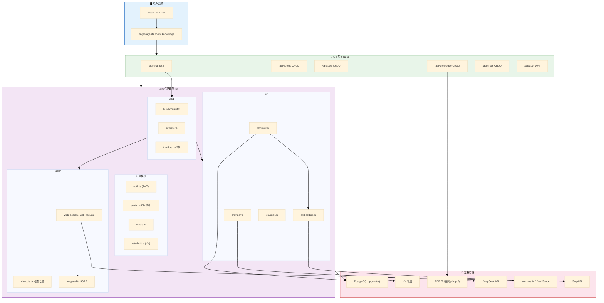
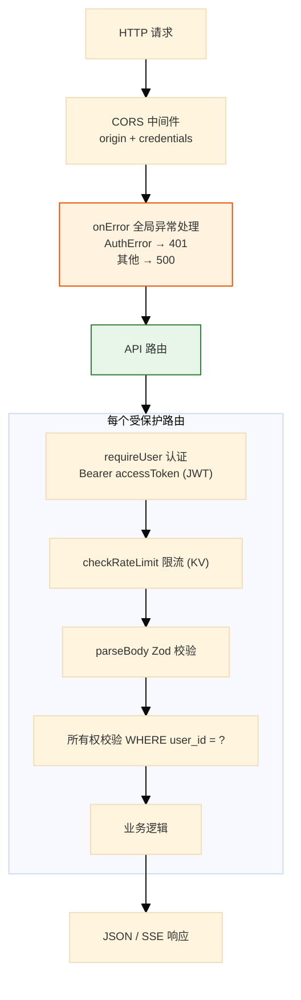
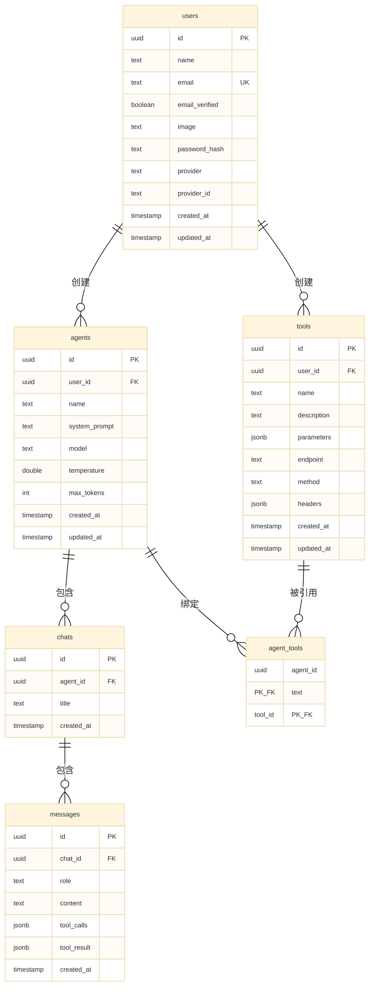
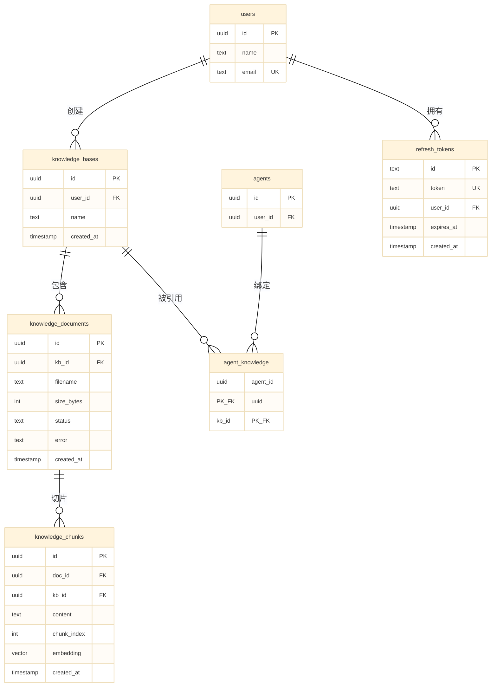
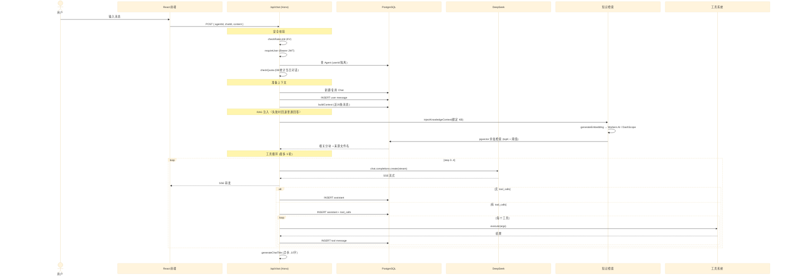
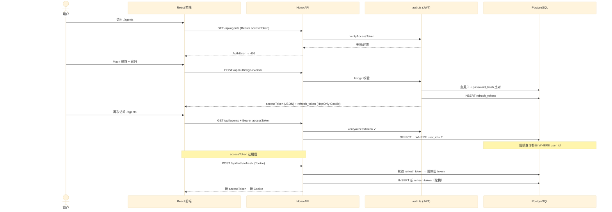

# 架构文档

> 版本: v4.0 | 日期: 2026-08-08
> 本文档描述**当前代码实际实现**的架构。若与历史文档（D1 / Vectorize / Better Auth 等）不一致，以本文件与代码为准。

## 概述

Simple AI Agent Platform 是一个轻量级多用户 AI Agent 管理平台。基于 Hono + Cloudflare Workers，前端使用 Vite + React 19，提供 Agent 创建/配置、流式对话、工具调用、知识库（RAG）和用户认证功能。

## 技术栈

| 层级 | 技术 | 版本 |
|------|------|------|
| Backend | Hono (Cloudflare Workers) | 4.7 |
| Frontend | React + Vite + Tailwind CSS + @base-ui/react | 19 / 8 / 4 |
| Language | TypeScript (strict) | 6 |
| Database | PostgreSQL（Cloudflare Hyperdrive 代理，本地用 postgres.js 直连） | 18+ |
| Vector DB | PostgreSQL pgvector (cosine, 1024d) | — |
| ORM | Drizzle ORM (postgres-js adapter, pg-core) | 0.45 |
| AI SDK | OpenAI SDK / Vercel AI SDK (DeepSeek) | 6 |
| Streaming | ReadableStream SSE | — |
| Embedding | workers-ai (@cf/baai/bge-m3) / DashScope (text-embedding-v3) / mock，三选一 | — |
| Auth | 自研 JWT (jose) + refresh token 轮换 + bcryptjs 密码哈希 | — |
| PDF 解析 | Worker 内本地解析（unpdf / PDF.js serverless），无独立服务 | — |
| Validation | Zod | 4 |
| Cache | Cloudflare KV（限流） | — |
| Deploy | Cloudflare Workers + Pages | — |

> 说明：本文档不含 D1 / Cloudflare Vectorize / Better Auth。数据库为 PostgreSQL（含 pgvector），认证为自研 JWT，嵌入通过 `EMBEDDING_PROVIDER` 切换。

---

## 1. 系统分层架构



---

## 2. 安全与错误处理

### 请求处理流水线



认证错误通过 `AuthError` throw + `app.onError` 全局处理器捕获，返回 `401`。非认证错误返回 `500`。

- 访问令牌（access token）：短期 JWT（15 分钟），由客户端放在 `Authorization: Bearer` 头传递（`src/lib/jwt.ts`）。
- 刷新令牌（refresh token）：256bit 随机串，存库并写入 HttpOnly Cookie，7 天有效期，刷新时一次性轮换（`src/routes/auth.ts`）。
- 密码使用 bcrypt 加盐哈希存储，绝不明文保存。
- 数据隔离：所有查询都以当前 `userId` 为前缀过滤（`WHERE user_id = ?`），资源归属不符返回 404（不暴露存在性）。

---

## 3. 数据模型（11 张表）

### 业务数据



### 知识库 + 认证



> 级联删除：`knowledge_documents` / `knowledge_chunks` 依赖 `kb_id` 与 `doc_id` 的 `onDelete: cascade`，删除知识库或文档时级联清理分块与向量，无孤儿数据。

---

## 4. 对话核心流程



---

## 5. 工具调用循环

```mermaid
%%{init: {'theme': 'base', 'themeVariables': {'fontSize': '9px'}, 'sequence': {'width': 650, 'actorMargin': 30, 'messageMargin': 15}}}%%
sequenceDiagram
    participant Loop as tool-loop.ts
    participant LLM as DeepSeek
    participant Tool as getTool()
    participant Builtin as 内置工具
    participant DBTool as 自定义工具
    participant Guard as url-guard.ts
    participant DB as PostgreSQL

    Note over Loop: 最多 5 轮

    Loop->>LLM: completions.create(stream, tools)
    LLM-->>Loop: 流式文本块

    alt 有 tool_calls
        Loop->>DB: INSERT assistant + tool_calls

        loop 每个 tool_call
            Loop->>Tool: getTool(name)

            alt web_search (内置)
                Tool->>Builtin: search-execute.ts
                Builtin->>Builtin: fetch SerpAPI
                Builtin-->>Tool: top 5 结果
            else web_request (内置)
                Tool->>Builtin: web-request-execute.ts
                Builtin->>Guard: validateExternalUrlWithDNS
                Guard-->>Builtin: 放行
                Builtin->>Builtin: fetch (redirect:error)
                Builtin-->>Tool: 文本 ≤2000字
            else 自定义工具 (DB)
                Tool->>DBTool: db-tools.ts
                DBTool->>Guard: validate + sanitizeHeaders
                DBTool->>DBTool: fetch (redirect:error)
                DBTool-->>Tool: 文本 ≤2000字
            end

            Tool-->>Loop: 结果
            Loop->>DB: INSERT tool message
        end
    end
```

---

## 6. 目录结构

```
backend/
├── src/
│   ├── index.ts              # Hono 应用入口 (CORS + onError + DB 生命周期 + 路由)
│   ├── routes/
│   │   ├── _middleware.ts     # requireUser (Bearer JWT) + AuthError
│   │   ├── auth.ts            # /api/auth 注册/登录/刷新/登出/会话
│   │   ├── agents.ts          # /api/agents CRUD
│   │   ├── chat.ts            # /api/chat SSE 流式
│   │   ├── chats.ts           # /api/chats CRUD + 消息分页
│   │   ├── tools.ts           # /api/tools CRUD
│   │   ├── knowledge.ts       # /api/knowledge CRUD + 文档上传/解析/异步嵌入
│   │   └── health.ts          # /api/health
│   └── lib/
│       ├── ai/
│       │   ├── provider.ts    # DeepSeek 客户端
│       │   ├── embedding.ts   # workers-ai / dashscope / mock
│       │   ├── chunker.ts     # 分块 (800/300/100)
│       │   └── retriever.ts   # pgvector 余弦检索
│       ├── chat/
│       │   ├── build-context.ts   # 消息 → LLM 上下文
│       │   ├── retrieve.ts        # 知识库注入
│       │   ├── tool-loop.ts       # 多轮工具循环
│       │   └── generate-title.ts  # LLM 生成标题
│       ├── tools/
│       │   ├── types.ts           # Tool 接口
│       │   ├── index.ts           # 内置工具注册
│       │   ├── search.ts / search-execute.ts
│       │   ├── web-request.ts / web-request-execute.ts
│       │   ├── db-tools.ts        # 自定义工具代理
│       │   └── url-guard.ts       # SSRF 防护
│       ├── db/
│       │   ├── index.ts           # postgres.js + Drizzle + AsyncLocalStorage
│       │   ├── helpers.ts         # findById / syncManyToMany
│       │   └── schema/            # 11 张表
│       ├── util/
│       │   ├── encoding.ts        # UTF-8 / GBK 自动解码
│       │   ├── text.ts            # 分块去重
│       │   └── uuid.ts
│       ├── jwt.ts               # access token (jose) + refresh token 生成
│       ├── config.ts             # 统一配置
│       ├── env-holder.ts         # Cloudflare env 注入
│       ├── errors.ts             # 统一错误响应
│       ├── logger.ts             # 日志
│       ├── quota.ts              # 配额 (DB 统计当日对话 / 存储用量)
│       ├── rate-limit.ts         # KV 限流
│       ├── validate.ts           # Zod 包装
│       ├── validators.ts         # Zod Schema
│       └── types.ts              # 类型定义
├── scripts/
│   └── seed.ts                   # 初始化（参考）
├── wrangler.jsonc
├── drizzle.config.ts
└── package.json

services/
└── base/                       # 【已停用】PDF 解析服务 (Python FastAPI + PyMuPDF)，代码保留作参考/回退
    ├── app/
    │   ├── main.py             # GET /health + POST /doc-parser/parse
    │   └── pdf_parser.py       # PyMuPDF 文字层提取
    ├── docker/Dockerfile
    ├── pyproject.toml
    └── run.py                  # 本地运行入口

frontend/
├── src/
│   ├── App.tsx               # 路由 + Auth + QueryClient
│   ├── main.tsx              # 入口
│   ├── pages/                # agents / tools / knowledge / login / signup
│   ├── components/           # chat / ui / sidebar / empty-state / confirm-dialog
│   ├── hooks/                # useChat (SSE)
│   └── lib/                  # api / auth / types / utils
├── vite.config.ts
└── package.json
```

---

## 7. 认证流程



---

## 环境变量

| 变量 | 必填 | 说明 |
|------|:--:|------|
| `DEEPSEEK_API_KEY` | ✅ | DeepSeek API Key |
| `DEEPSEEK_BASE_URL` | 可选 | DeepSeek API 地址（默认 `https://api.deepseek.com/v1`） |
| `JWT_SECRET` | ✅ | access token 签名密钥 (`openssl rand -base64 32`) |
| `SERPAPI_API_KEY` | 可选 | 网页搜索（不配则工具不可用） |
| `EMBEDDING_PROVIDER` | 可选 | 嵌入服务：`workers-ai`（默认）/ `dashscope` / `mock`（仅本地调试；失败不再自动降级，生产失败即标记文档 failed） |
| `DASHSCOPE_API_KEY` | 按需 | 阿里云百炼 Key（`EMBEDDING_PROVIDER=dashscope` 时需要） |
| `DASHSCOPE_BASE_URL` | 可选 | DashScope 兼容地址（默认官方） |
| `DASHSCOPE_EMBEDDING_MODEL` | 可选 | 默认 `text-embedding-v3`（1024 维，与 schema 匹配） |
| `DATABASE_URL` | 本地开发 | 本地 PostgreSQL 连接串（生产用 Hyperdrive） |

知识库检索参数（可选，见 `src/lib/config.ts`）：`KNOWLEDGE_TOP_K`、`KNOWLEDGE_SIMILARITY_THRESHOLD`（cosine **距离**阈值，越小越严格）、`KNOWLEDGE_CHUNK_MAX_CHARS` / `MIN_CHARS` / `OVERLAP`、`KNOWLEDGE_EMBEDDING_BATCH_SIZE`、`KNOWLEDGE_MAX_FILE_SIZE`（默认 5MB）、`KNOWLEDGE_MAX_PDF_PAGES`（默认 100）。配额与限流参数：`QUOTA_FREE_*`、`RATE_LIMIT_*`。

Cloudflare 绑定（通过 `wrangler.jsonc` 配置，非环境变量）：
- `HYPERDRIVE` — 连接 PostgreSQL（含 pgvector）
- `RATE_LIMIT_KV` — 限流 KV
- `QUOTA_KV` — 配额 KV（按天计数真实请求次数）
- `AI` — Workers AI 嵌入（`EMBEDDING_PROVIDER=workers-ai` 时需要）

Cron 触发器（`wrangler.jsonc` `triggers`）：
- `0 */6 * * *` — 每 6 小时回收超时（>30 分钟）卡在 `processing` 的知识库文档，标记为 `failed`（见 `recoverStaleProcessingDocs`）

---

## 部署

- Cloudflare Workers + Pages：参见 [cloudflare-deployment.md](cloudflare-deployment.md)
- PDF 解析在 Worker 内本地完成（unpdf），无需独立服务；base 服务（ECS，已停用）部署参见 [ecs-deployment.md](ecs-deployment.md)
