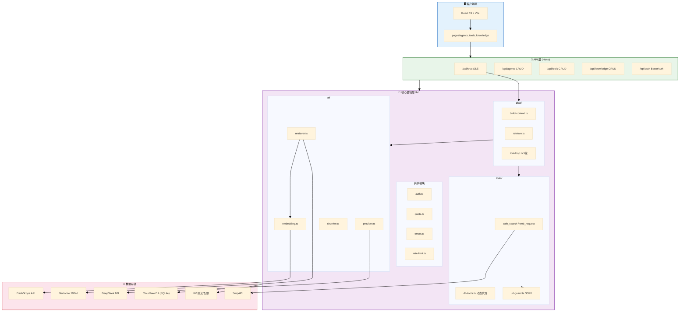
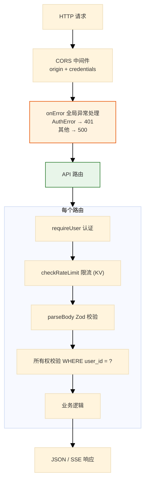
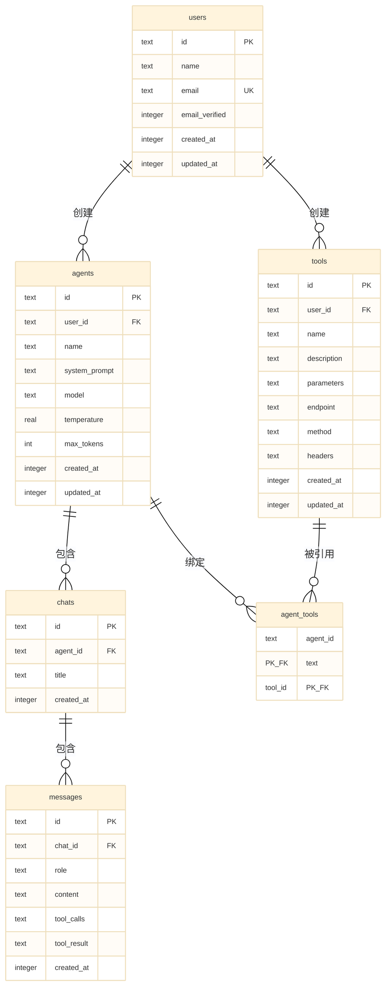
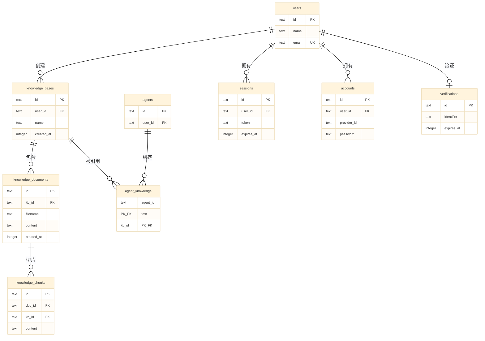
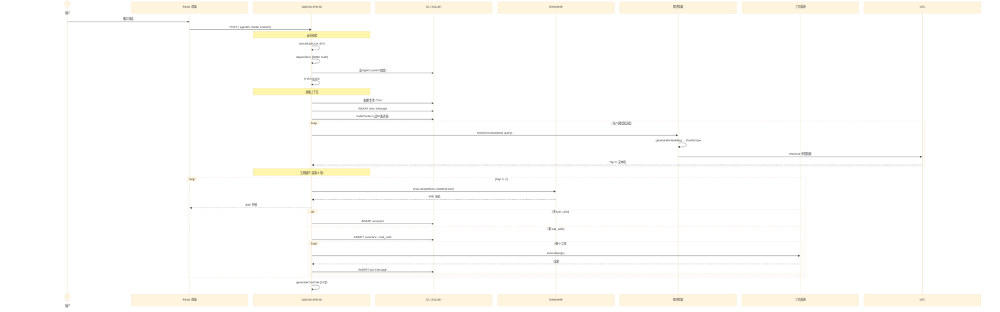
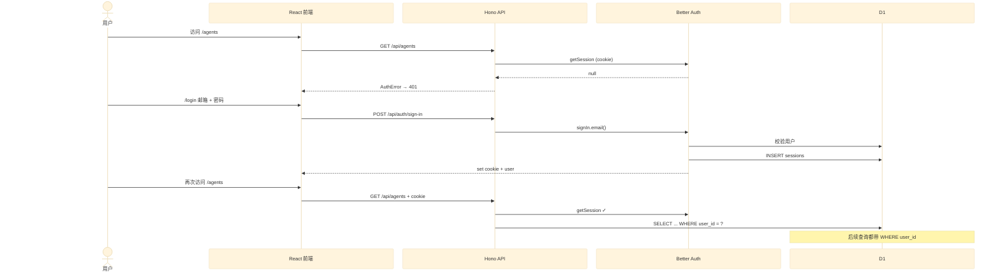

# 架构文档

> 版本: v3.1 | 日期: 2026-07-28

## 概述

Simple AI Agent Platform 是一个轻量级多用户 AI Agent 管理平台。基于 Hono + Cloudflare Workers，前端使用 Vite + React 19，提供 Agent 创建/配置、流式对话、工具调用、知识库（RAG）和用户认证功能。

## 技术栈

| 层级 | 技术 | 版本 |
|------|------|------|
| Backend | Hono (Cloudflare Workers) | 4.7 |
| Frontend | React + Vite + Tailwind CSS + @base-ui/react | 19 / 8 / 4 |
| Language | TypeScript (strict) | 6 |
| Database | Cloudflare D1 (SQLite) | — |
| Vector DB | Cloudflare Vectorize (cosine, 1024d) | — |
| ORM | Drizzle ORM (SQLite dialect) | 0.45 |
| AI SDK | Vercel AI SDK + OpenAI SDK (DeepSeek) | 6 |
| Streaming | ReadableStream SSE | — |
| Embedding | 阿里云 DashScope (text-embedding-v3) | 1024 dims |
| Auth | Better Auth (邮箱+密码, SQLite adapter) | 1.x |
| Validation | Zod | 4 |
| Cache | Cloudflare KV (限流/配额) | — |
| Deploy | Cloudflare Workers + Pages | — |

---

## 1. 系统分层架构



---

## 2. 安全与错误处理

### 请求处理流水线



认证错误通过 `AuthError` throw + `app.onError` 全局处理器捕获，返回 `401`。非认证错误返回 `500`。

---

## 3. 数据模型（13 张表）

### 业务数据



### 知识库 + 认证



---

## 4. 对话核心流程



---

## 5. 工具调用循环

```mermaid
%%{init: {'theme': 'base', 'themeVariables': {'fontSize': '9px'}, 'sequence': {'width': 650, 'actorMargin': 30, 'messageMargin': 15}}}%%
sequenceDiagram
    participant Loop as tool-loop.ts
    participant LLM as DeepSeek
    participant Tool as getTool()
    participant Builtin as 内置工具
    participant DBTool as 自定义工具
    participant Guard as url-guard.ts
    participant DB as D1

    Note over Loop: 最多 5 轮

    Loop->>LLM: completions.create(stream, tools)
    LLM-->>Loop: 流式文本块

    alt 有 tool_calls
        Loop->>DB: INSERT assistant + tool_calls

        loop 每个 tool_call
            Loop->>Tool: getTool(name)

            alt web_search (内置)
                Tool->>Builtin: search-execute.ts
                Builtin->>Builtin: fetch SerpAPI
                Builtin-->>Tool: top 5 结果
            else web_request (内置)
                Tool->>Builtin: web-request-execute.ts
                Builtin->>Guard: validateExternalUrlWithDNS
                Guard-->>Builtin: 放行
                Builtin->>Builtin: fetch (redirect:error)
                Builtin-->>Tool: 文本 ≤2000字
            else 自定义工具 (DB)
                Tool->>DBTool: db-tools.ts
                DBTool->>Guard: validate + sanitizeHeaders
                DBTool->>DBTool: fetch (redirect:error)
                DBTool-->>Tool: 文本 ≤2000字
            end

            Tool-->>Loop: 结果
            Loop->>DB: INSERT tool message
        end
    end
```

---

## 6. 目录结构

```
backend/
├── src/
│   ├── index.ts              # Hono 应用入口 (CORS + 路由 + onError)
│   ├── routes/
│   │   ├── _middleware.ts     # requireUser 认证 + AuthError
│   │   ├── auth.ts            # /api/auth (Better Auth)
│   │   ├── agents.ts          # /api/agents CRUD
│   │   ├── chat.ts            # /api/chat SSE 流式
│   │   ├── chats.ts           # /api/chats CRUD
│   │   ├── tools.ts           # /api/tools CRUD
│   │   ├── knowledge.ts       # /api/knowledge CRUD + 文档上传
│   │   └── health.ts          # /api/health
│   └── lib/
│       ├── ai/
│       │   ├── provider.ts    # DeepSeek 客户端 + AI SDK
│       │   ├── embedding.ts   # DashScope 嵌入
│       │   ├── chunker.ts     # 分块 (800/100)
│       │   └── retriever.ts   # Vectorize 余弦检索
│       ├── chat/
│       │   ├── build-context.ts   # 消息 → LLM 上下文
│       │   ├── retrieve.ts        # 知识库注入
│       │   ├── tool-loop.ts       # 多轮工具循环
│       │   └── generate-title.ts  # LLM 生成标题
│       ├── tools/
│       │   ├── types.ts           # Tool 接口
│       │   ├── index.ts           # 内置工具注册
│       │   ├── search.ts / search-execute.ts
│       │   ├── web-request.ts / web-request-execute.ts
│       │   ├── db-tools.ts        # 自定义工具代理
│       │   └── url-guard.ts       # SSRF 防护
│       ├── db/
│       │   ├── index.ts           # Drizzle + D1 适配
│       │   ├── helpers.ts         # findById / syncManyToMany
│       │   └── schema/            # 13 张表
│       ├── auth.ts               # Better Auth 配置
│       ├── config.ts             # 统一配置
│       ├── env-holder.ts         # Cloudflare env 注入
│       ├── errors.ts             # 统一错误响应
│       ├── logger.ts             # 日志
│       ├── quota.ts              # 配额
│       ├── rate-limit.ts         # KV 限流
│       ├── validate.ts           # Zod 包装
│       ├── validators.ts         # Zod Schema
│       └── types.ts              # 类型定义
├── scripts/
│   └── seed.ts                   # 管理员初始化（参考）
├── wrangler.jsonc
├── drizzle.config.ts
└── package.json

frontend/
├── src/
│   ├── App.tsx               # 路由 + Auth + QueryClient
│   ├── main.tsx              # 入口
│   ├── pages/                # agents / tools / knowledge / login / signup
│   ├── components/           # chat / ui / sidebar / empty-state / confirm-dialog
│   ├── hooks/                # useChat (SSE)
│   └── lib/                  # api / auth / types / utils
├── vite.config.ts
└── package.json
```

---

## 7. 认证流程



---

## 环境变量

| 变量 | 必填 | 说明 |
|------|:--:|------|
| `DEEPSEEK_API_KEY` | ✅ | DeepSeek API Key |
| `BETTER_AUTH_SECRET` | ✅ | Auth 加密密钥 (`openssl rand -base64 32`) |
| `BETTER_AUTH_URL` | ✅ | 应用 URL |
| `DEEPSEEK_BASE_URL` | 可选 | DeepSeek API 地址（默认 `https://api.deepseek.com/v1`） |
| `SERPAPI_API_KEY` | 可选 | 网页搜索（不配则工具不可用） |
| `BAILIAN_API_KEY` | 可选 | 文本嵌入（不配则知识库不可用） |

Cloudflare 绑定（通过 `wrangler.jsonc` 配置，非环境变量）：
- `DB` — D1 数据库
- `VECTORIZE` — Vectorize 索引
- `RATE_LIMIT_KV` — 限流 KV
- `QUOTA_KV` — 配额 KV

---

## 部署

参见 [cloudflare-deployment.md](cloudflare-deployment.md)。
